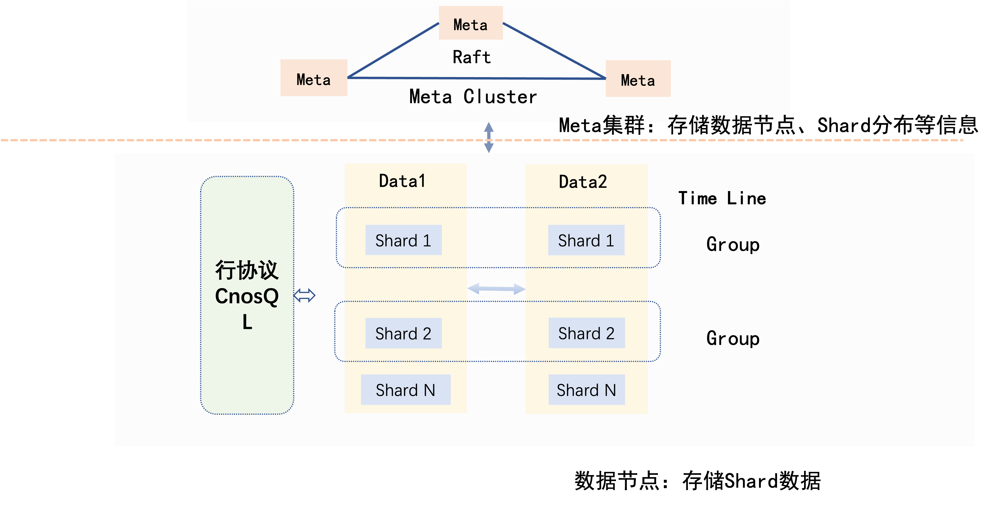
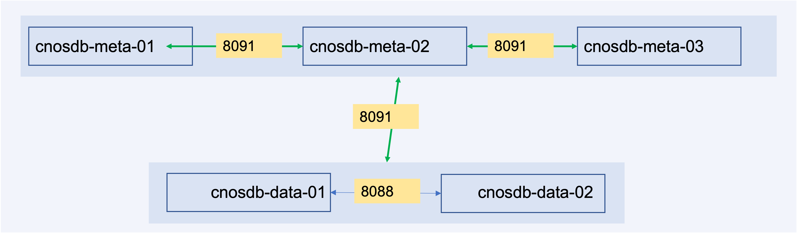

# CnosDB分布式部署

摘要：本次分享内容为往期内容的回顾以及新出炉的分布式版本

1. 回顾CnosDB基本概念
2. CnosDB分布式部署

## 回顾CnosDB基本概念

### 一些基本概念

#### series
#### point
#### measurement
#### tag
#### tag key
#### tag value
#### tag set
#### field
#### field key
#### field value
#### field set
#### timestamp
#### retention policy

### 集群角色

#### cnosdb

CnosDB的主进程，可以单独启动对外提供服务，也可以与cnosdb-meta公共启动对外提供服务

#### cnosdb-meta

CnosDB的元数据管理节点，用于协调集群，必需与cnosdb搭配使用，cnosdb-meta中只存储节点信息、节点上的分片信息，数据库，保留策略，订阅信息以及权限和角色
同时cnosdb-meta节点必需为3个及以上的奇数个，因为其使用raft协议来维护节点的一致性，它使用选举机制保证集群一定会存在一个leader节点，奇数个节点能够保证被选举的节点能够得到大多数选票，从而成为leader节点

#### 部署架构

最小集群部署架构请参考一下图片，由3个cnosdb-meta节点和2个cnosdb节点组成
cnosdb节点的数量必需被保留策略中复制因子数量整除，如果保留策略的复制因子数量是2，cnosdb节点的数量必需为2，4，6，...,
如果保留策略的复制因子数量是3，cnosdb节点数量必需为3，6，9

## CnosDB分布式部署

### 安装cnosdb-meta，并将它们加入集群

### 安装cnosdb，并将它们加入集群

